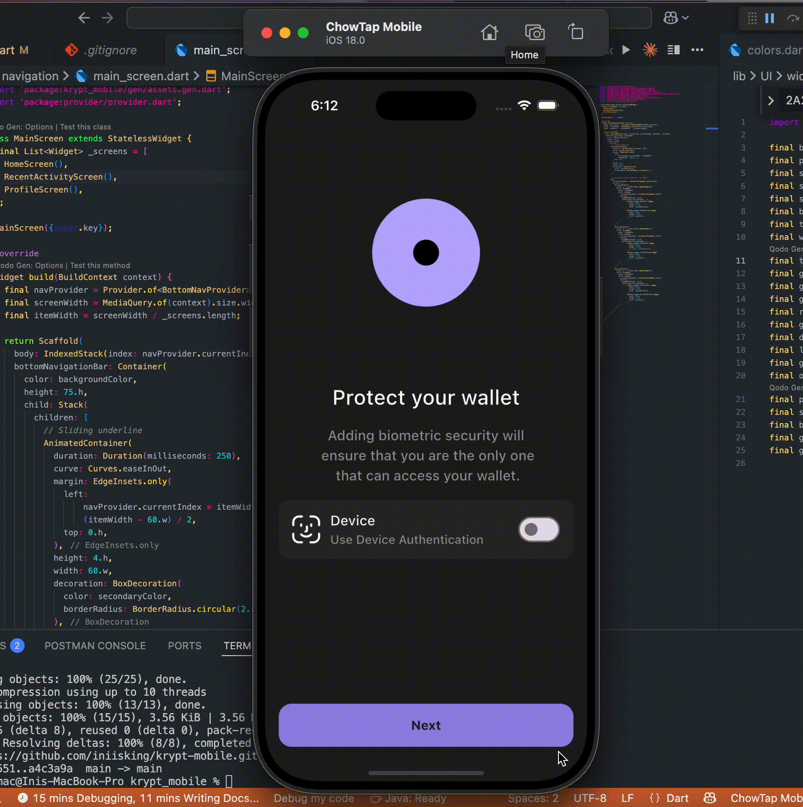

<p align="center">
  <b>Krypt Mobile</b> — a Flutter wallet-style app. Frontend uses Flutter with Bloc for state management. Backend is Spring Boot deployed on AWS.
</p>

<p align="center">
  <a href="#demo">Demo</a> •
  <a href="#features">Features</a> •
  <a href="#architecture">Architecture</a> •
  <a href="#getting-started">Getting Started</a> •
  <a href="#project-structure">Project Structure</a> •
  <a href="#backend">Backend</a> •
  <a href="#roadmap">Roadmap</a> •
  <a href="#license">License</a>
</p>

### Demo





### Features

- Wallet onboarding and authentication (email verification, device auth, seed phrase flows)
- Token management (send, receive, select token, recent activity and details)
- Responsive UI with `flutter_screenutil` and custom widgets
- Share integration via `share_plus`
- Smooth onboarding experience with `smooth_page_indicator` and `lottie` animations

### Architecture

- **Frontend**: Flutter, Bloc for state management (UI in `lib/UI`, navigation and screens modularized)
- **Backend**: Spring Boot services deployed to AWS (API-driven)
- **Codegen**: `flutter_gen_runner` + `build_runner` for assets, fonts, and SVG/Lottie integrations

#### State Management

- Bloc/Cubit pattern for predictable state and separation of concerns
- Event-driven updates, immutable states, and clear UI state mapping

### Getting Started

Prerequisites:

- Flutter SDK 3.8+ and Dart 3.8+
- Xcode (iOS) / Android Studio (Android)

Install dependencies:

```bash
flutter pub get
```

Generate asset/font references (keep in sync with `pubspec.yaml`):

```bash
dart run build_runner build --delete-conflicting-outputs
```

Run the app:

```bash
# iOS
flutter run -d ios

# Android
flutter run -d android
```

Optional: watch mode for codegen during development

```bash
dart run build_runner watch
```

### Project Structure

```
lib/
  UI/
    navigation/
    screens/
    widgets/
  controller/
  gen/                # generated by flutter_gen
  main.dart
assets/
  images/ fonts/ svg/ lottie/
```

### Backend

- Implemented with Spring Boot and deployed on AWS (e.g., Elastic Beanstalk/ECS/Lambda + API Gateway)
- Exposes REST endpoints consumed by the Flutter app
- Authentication and secure storage aligned with mobile client flows

Provide links or repo references:

- Backend repository: <your-backend-repo-link>
- API base URL: <your-api-base-url>

### Configuration

- Add environment/config handling for API endpoints (e.g., `--dart-define=API_BASE_URL=...`)
- Store secrets securely; never commit keys to the repo
- Create a `.env` file (see `.env.example`) and the app will load it via `flutter_dotenv`.

### Scripts

Common commands for contributors:

```bash
# Format & analyze
flutter format . && flutter analyze

# Run tests
flutter test

# Build release
flutter build apk --release
flutter build ios --release
```

### Roadmap

- Improve token portfolio and charts
- Integrate push notifications
- Add biometrics with fallback and advanced session management
- Expand test coverage and CI/CD

### Contributing

Pull requests are welcome. Please open an issue to discuss major changes.

### License

This project is licensed under the MIT License — see `LICENSE` for details.
